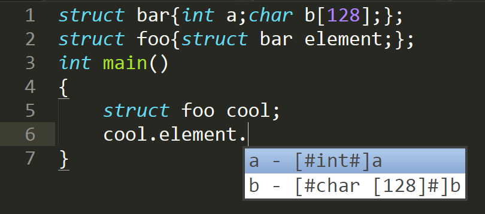

#ClangAutoComplete
=================

Sublime Text 3 plugin that offers auto-completion of C/C++ structure members or class attributes and methods.

This plug-in is still maintained, but not very actively. I recommend to consider [EasyClangComplete](https://packagecontrol.io/packages/EasyClangComplete) for more features and frequent updates.



##Installation

1. Install "clang". Note that some people reported issue with clang 3.5.2 when compiled from Cygwin. If you are facing issues on Windows, try to download directly from the official [clang website](http://llvm.org/releases/download.html).
2. Install from Package Control, or clone this repository and put it in your Sublime's packages directory to install from git.
3. Edit the settings to your needs (in menu `Preferences/Package Settings/ClaugAutoComplete/Settings`). 

##Troubleshooting
If completion does not work, it is almost always because of a problem with the `include_dirs` settings.

1. Set the `debug` settings to `"true"` and attempt completion. An output panel will appear containing the result of the process. For it to work, there has to be lines starting with `COMPLETION:`. If you see any error like `#include <file>: file not found`, you need to add the path to that file in the `include_dirs` settings.

2. The standard header files should automatically be located, but if nothing works, you should try to manually add them. Here is what it could look like
        
 ```C
 "include_dirs" : [
              "/usr/include/c++/4.4.7/",                      /* Where you find iostream, vector, etc. */
              "/usr/lib/clang/3.4.2/include",                 /* stdbool, etc */
              "/usr/include/c++/4.4.4/x86_64-redhat-linux/",  /* bits folder */
              "/usr/include",
 ```
 
 If you can't find the equivalent path try to search your system to find those key files and add the paths, i.e.
 
 ```bash
sudo find / -name "iostream"
sudo find / -name "stdbool.h"
sudo find / -name "c++config.h"
 ```
        
3. Make sure Sublime's own auto-complete settings are properly configured, I've had trouble with mine.
Here is my C.sublime-settings as an example


        {
                "auto_complete": true,
                "auto_complete_selector": "source - comment",
                "auto_complete_triggers":
                [
                        {
                                "characters": "."
                        },
                        {
                                "characters": ">"
                        },
                ],
                "extensions":
                [
                        "c",
                        "h"
                ]
        }

##Settings

 - include_dirs: List of directories where relevant header files are located
 - autocomplete_all: Trigger auto-completion on every keypress (will slow down sublime)
 - selectors: List of characters that will trigger auto-completion ( if "autocomplete_all" is set to "false" )
 - clang_binary: Location of clang binary (if it is not in the path)
 - You can copy the whole settings file under your project base folder named as ".clangautocomplete" to have the plugin load those instead of the general settings.
 - debug and verbose: Set to true to help understand what is going wrong (if completion is not working)

##Recommended plugins for C development
Here are some useful plugins I use alongside ClangAutoComplete to have a more complete experience.
- [CTags: Code navigation, goto definition](https://packagecontrol.io/packages/CTags)
- [SublimeLinter](https://packagecontrol.io/packages/SublimeLinter) and [SublimeLinter-contrib-clang](https://packagecontrol.io/packages/SublimeLinter-contrib-clang): Errors and warnings highlights. 
 
##License
DO WHAT THE FUCK YOU WANT TO PUBLIC LICENSE

Version 2, December 2004

Copyright (C) 2016 Pierre-Louis Caron-Auger

Everyone is permitted to copy and distribute verbatim or modified copies of this license document, and changing it is allowed as long as the name is changed.

DO WHAT THE FUCK YOU WANT TO PUBLIC LICENSE TERMS AND CONDITIONS FOR COPYING, DISTRIBUTION AND MODIFICATION

0.You just DO WHAT THE FUCK YOU WANT TO.
